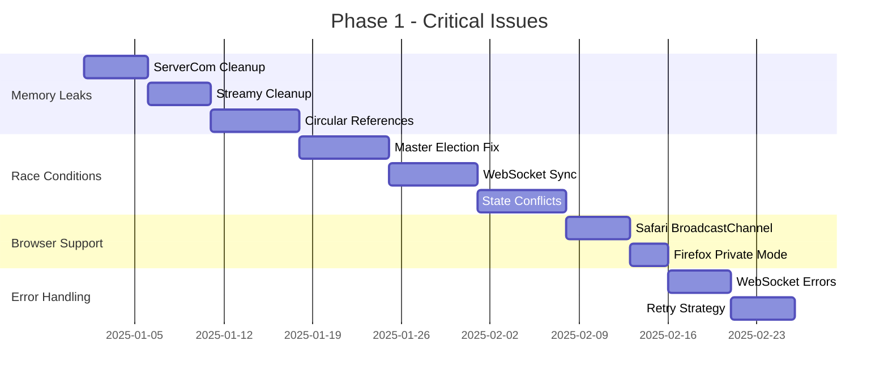

# VineHelper Improvement Plan

## Executive Summary

This document consolidates all findings from the VineHelper code analysis and provides a prioritized, actionable improvement plan. Based on the analysis of 6 commits on the `fix/remaining-debug-improvements` branch and comprehensive code review, we've identified **47 total improvements** across 7 categories.

### Key Statistics

- 🔴 **Critical Issues**: 12 (26%)
- 🟡 **High Priority**: 15 (32%)
- 🟢 **Medium Priority**: 13 (28%)
- 🔵 **Low Priority**: 7 (14%)

### Immediate Action Required

1. Fix memory leaks causing browser crashes
2. Resolve race conditions in multi-tab coordination
3. Address Safari/Firefox compatibility issues

### Estimated Total Effort

- **Phase 1 (Critical)**: 6-8 weeks
- **Phase 2 (High)**: 8-10 weeks
- **Phase 3 (Medium)**: 10-12 weeks
- **Phase 4 (Low)**: 6-8 weeks
- **Total**: 30-38 weeks (7-9 months)

---

## Table of Contents

1. [Memory Management](#1-memory-management)
2. [Race Conditions & Synchronization](#2-race-conditions--synchronization)
3. [Performance Optimization](#3-performance-optimization)
4. [Browser Compatibility](#4-browser-compatibility)
5. [Error Handling & Reliability](#5-error-handling--reliability)
6. [Code Quality & Maintainability](#6-code-quality--maintainability)
7. [Testing & Documentation](#7-testing--documentation)
8. [Implementation Roadmap](#implementation-roadmap)
9. [Success Metrics](#success-metrics)

---

## 1. Memory Management

### 🔴 MM-001: ServerCom WebSocket Cleanup

**Problem**: ServerCom instances growing 3x over time, event listeners not removed
**Solution**:

- Implement proper destroy() method
- Track all event listeners in a Map
- Remove channel message handler on cleanup
  **Affected Files**:
- `scripts/notifications-monitor/stream/ServerCom.js`
  **Complexity**: Medium
  **Dependencies**: None

### 🔴 MM-002: Streamy Event Listener Leak

**Problem**: Stream objects accumulating, no cleanup on destroy
**Solution**:

- Add event listener tracking
- Implement removeAllListeners() method
- Clear references in destroy()
  **Affected Files**:
- `scripts/core/utils/Streamy.js`
  **Complexity**: Medium
  **Dependencies**: None

### 🔴 MM-003: Circular References in Event Handlers

**Problem**: Event handlers holding references to parent objects preventing GC
**Solution**:

- Use WeakMap for DOM element associations
- Implement proper cleanup patterns
- Avoid closures that capture parent scope
  **Affected Files**:
- `scripts/notifications-monitor/core/NotificationMonitor.js`
- `scripts/notifications-monitor/services/GridEventManager.js`
  **Complexity**: Complex
  **Dependencies**: MM-001, MM-002

### 🟡 MM-004: DOM Element Retention

**Problem**: Detached DOM nodes not being garbage collected (100+ nodes)
**Solution**:

- Implement virtual scrolling for large lists
- Use DocumentFragment for batch operations
- Clear all references when removing elements
  **Affected Files**:
- `scripts/notifications-monitor/services/NoShiftGrid.js`
- `scripts/ui/components/Tile.js`
  **Complexity**: Complex
  **Dependencies**: PO-001

### 🟡 MM-005: Excessive Event Listeners

**Problem**: Event listener count growing unbounded (1000+ listeners)
**Solution**:

- Use event delegation instead of individual listeners
- Implement listener pooling
- Add maximum listener limits
  **Affected Files**:
- `scripts/notifications-monitor/core/NotificationMonitor.js`
  **Complexity**: Medium
  **Dependencies**: None

### 🟢 MM-006: KeywordMatch Instance Accumulation

**Problem**: Multiple KeywordMatch instances retained in memory
**Solution**:

- Implement singleton pattern for SharedKeywordMatcher
- Add periodic cache cleanup
- Use LRU cache with size limits
  **Affected Files**:
- `scripts/core/utils/KeywordMatch.js`
- `scripts/core/utils/SharedKeywordMatcher.js`
  **Complexity**: Simple
  **Dependencies**: None

---

## 2. Race Conditions & Synchronization

### 🔴 RC-001: Master Election Race Condition

**Problem**: Multiple tabs can become master simultaneously during election
**Solution**:

- Implement proper locking mechanism using timestamp-based priority
- Add random backoff for collision resolution
- Use atomic operations for state updates
  **Affected Files**:
- `scripts/notifications-monitor/coordination/MasterSlave.js`
  **Complexity**: Complex
  **Dependencies**: None

### 🔴 RC-002: Concurrent WebSocket Connections

**Problem**: Multiple tabs attempting WebSocket connections simultaneously
**Solution**:

- Ensure only master tab creates WebSocket
- Add connection state synchronization
- Implement connection handoff on master change
  **Affected Files**:
- `scripts/notifications-monitor/stream/Websocket.js`
- `scripts/notifications-monitor/coordination/MasterSlave.js`
  **Complexity**: Complex
  **Dependencies**: RC-001

### 🔴 RC-003: State Synchronization Conflicts

**Problem**: Item state updates can be lost or duplicated across tabs
**Solution**:

- Implement version vectors for state tracking
- Add conflict resolution strategy
- Use transaction-like updates
  **Affected Files**:
- `scripts/notifications-monitor/services/ItemsMgr.js`
  **Complexity**: Complex
  **Dependencies**: RC-001, RC-002

### 🟡 RC-004: BroadcastChannel Message Ordering

**Problem**: Messages can arrive out of order causing state inconsistencies
**Solution**:

- Add sequence numbers to messages
- Implement message queue with ordering
- Add acknowledgment system
  **Affected Files**:
- `scripts/notifications-monitor/coordination/MasterSlave.js`
  **Complexity**: Medium
  **Dependencies**: RC-001

---

## 3. Performance Optimization

### 🔴 PO-001: Virtual Scrolling Implementation

**Problem**: All items rendered in DOM causing memory/performance issues with 1000+ items
**Solution**:

- Implement virtual scrolling with Intersection Observer
- Only render visible items plus buffer
- Recycle DOM elements during scroll
  **Affected Files**:
- `scripts/notifications-monitor/services/NoShiftGrid.js`
- `scripts/notifications-monitor/core/NotificationMonitor.js`
  **Complexity**: Complex
  **Dependencies**: None

### 🟡 PO-002: Keyword Matching Optimization

**Problem**: Regex compilation happening repeatedly (though partially fixed)
**Solution**:

- Complete SharedKeywordMatcher implementation
- Add worker thread for heavy matching
- Implement incremental matching
  **Affected Files**:
- `scripts/core/utils/KeywordMatch.js`
  **Complexity**: Medium
  **Dependencies**: None

### 🟡 PO-003: DOM Batch Operations

**Problem**: Individual DOM updates causing multiple reflows
**Solution**:

- Batch all DOM updates with requestAnimationFrame
- Use DocumentFragment for insertions
- Implement write/read separation
  **Affected Files**:
- `scripts/notifications-monitor/services/GridEventManager.js`
  **Complexity**: Medium
  **Dependencies**: None

### 🟢 PO-004: getComputedStyle Optimization

**Problem**: Safari performance issues with getComputedStyle in loops
**Solution**:

- Cache computed styles
- Batch style reads
- Use CSS classes instead of inline styles
  **Affected Files**:
- `scripts/notifications-monitor/services/VisibilityStateManager.js`
  **Complexity**: Simple
  **Dependencies**: None

---

## 4. Browser Compatibility

### 🔴 BC-001: Safari BroadcastChannel Support

**Problem**: BroadcastChannel not supported in Safari
**Solution**:

- Implement polyfill using localStorage events
- Add feature detection
- Provide fallback coordination mechanism
  **Affected Files**:
- `scripts/notifications-monitor/coordination/MasterSlave.js`
  **Complexity**: Medium
  **Dependencies**: None

### 🔴 BC-002: Firefox Private Browsing Issues

**Problem**: BroadcastChannel limited in Firefox private browsing
**Solution**:

- Detect private browsing mode
- Fall back to single-tab operation
- Show user notification
  **Affected Files**:
- `scripts/notifications-monitor/coordination/MasterSlave.js`
  **Complexity**: Simple
  **Dependencies**: BC-001

### 🟡 BC-003: Promise vs Callback API Differences

**Problem**: Browser API inconsistencies between Chrome/Firefox
**Solution**:

- Create unified API wrapper
- Use promisify utilities
- Add browser-specific adapters
  **Affected Files**:
- `scripts/infrastructure/RuntimeAdapter.js`
  **Complexity**: Medium
  **Dependencies**: None

### 🟡 BC-004: CSS Rendering Inconsistencies

**Problem**: Visual differences across browsers
**Solution**:

- Add CSS reset/normalize
- Use vendor prefixes where needed
- Test and fix specific issues
  **Affected Files**:
- `resource/css/*.css`
  **Complexity**: Simple
  **Dependencies**: None

---

## 5. Error Handling & Reliability

### 🔴 EH-001: Silent WebSocket Failures

**Problem**: WebSocket errors not surfaced to user
**Solution**:

- Add error event handlers
- Implement user notifications
- Add connection status indicator
  **Affected Files**:
- `scripts/notifications-monitor/stream/Websocket.js`
  **Complexity**: Medium
  **Dependencies**: None

### 🔴 EH-002: No Retry Strategy

**Problem**: Failed operations not retried
**Solution**:

- Implement exponential backoff
- Add maximum retry limits
- Queue failed operations
  **Affected Files**:
- `scripts/notifications-monitor/stream/ServerCom.js`
- `scripts/core/services/BrendaAnnounce.js`
  **Complexity**: Medium
  **Dependencies**: None

### 🟡 EH-003: Missing Error Boundaries

**Problem**: Errors can crash entire extension
**Solution**:

- Add try-catch blocks in critical paths
- Implement error boundary pattern
- Add error recovery mechanisms
  **Affected Files**:
- `scripts/notifications-monitor/core/NotificationMonitor.js`
  **Complexity**: Medium
  **Dependencies**: None

### 🟡 EH-004: Timeout Handling

**Problem**: Network requests can hang indefinitely
**Solution**:

- Add timeout to all network operations
- Implement request cancellation
- Add timeout configuration
  **Affected Files**:
- `scripts/bootloader.js`
  **Complexity**: Simple
  **Dependencies**: None

---

## 6. Code Quality & Maintainability

### 🟢 CQ-001: Large Class Refactoring

**Problem**: NotificationMonitor class over 2000 lines
**Solution**:

- Extract services for specific functionality
- Implement composition over inheritance
- Create smaller, focused modules
  **Affected Files**:
- `scripts/notifications-monitor/core/NotificationMonitor.js`
  **Complexity**: Complex
  **Dependencies**: None

### 🟢 CQ-002: Bootloader Simplification

**Problem**: Complex initialization logic hard to maintain
**Solution**:

- Break into initialization phases
- Extract feature modules
- Add initialization pipeline
  **Affected Files**:
- `scripts/bootloader.js`
  **Complexity**: Medium
  **Dependencies**: None

### 🟢 CQ-003: Reduce Coupling

**Problem**: High coupling between components
**Solution**:

- Define clear interfaces
- Use dependency injection
- Implement event-driven communication
  **Affected Files**:
- Multiple files across the codebase
  **Complexity**: Complex
  **Dependencies**: CQ-001

### 🟢 CQ-004: Code Duplication

**Problem**: Similar code patterns repeated
**Solution**:

- Extract common utilities
- Create shared base classes
- Implement DRY principles
  **Affected Files**:
- Various files with validation logic
  **Complexity**: Simple
  **Dependencies**: None

---

## 7. Testing & Documentation

### 🟡 TD-001: Integration Test Coverage

**Problem**: Missing tests for multi-tab scenarios
**Solution**:

- Add integration test suite
- Mock BroadcastChannel API
- Test state synchronization
  **Affected Files**:
- `tests/multi-tab-coordination.test.js`
  **Complexity**: Medium
  **Dependencies**: None

### 🟡 TD-002: Browser-Specific Tests

**Problem**: No tests for browser compatibility
**Solution**:

- Add browser-specific test suites
- Use Selenium for cross-browser testing
- Add compatibility matrix
  **Affected Files**:
- New test files needed
  **Complexity**: Medium
  **Dependencies**: None

### 🟡 TD-003: Performance Regression Tests

**Problem**: No automated performance testing
**Solution**:

- Add performance benchmarks
- Implement CI performance tests
- Track metrics over time
  **Affected Files**:
- New test infrastructure needed
  **Complexity**: Complex
  **Dependencies**: None

### 🟢 TD-004: E2E Test Coverage

**Problem**: Critical user flows not tested end-to-end
**Solution**:

- Add Puppeteer/Playwright tests
- Cover main user scenarios
- Add visual regression tests
  **Affected Files**:
- New E2E test suite needed
  **Complexity**: Medium
  **Dependencies**: None

### 🔵 TD-005: API Documentation

**Problem**: Missing comprehensive API docs
**Solution**:

- Add JSDoc comments
- Generate API documentation
- Create developer guide
  **Affected Files**:
- All public APIs
  **Complexity**: Simple
  **Dependencies**: None

---

## Implementation Roadmap

### Phase 1: Critical Issues (Weeks 1-8)

**Goal**: Fix blocking issues and prevent data loss

### Phase 2: High Priority (Weeks 9-18)

**Goal**: Improve performance and reliability

- Virtual scrolling implementation
- Complete keyword optimization
- DOM batching improvements
- Error boundaries and recovery
- Integration test suite

### Phase 3: Medium Priority (Weeks 19-30)

**Goal**: Improve code quality and maintainability

- Large class refactoring
- Reduce coupling
- Browser-specific optimizations
- E2E test coverage
- Code duplication removal

### Phase 4: Low Priority (Weeks 31-38)

**Goal**: Polish and enhance user experience

- API documentation
- Advanced filtering features
- UI/UX improvements
- Analytics implementation

---

## Success Metrics

### Memory Management

- **Target**: < 100MB heap usage with 1000 items
- **Metric**: No memory growth over 24-hour period
- **Measurement**: Chrome DevTools Memory Profiler

### Performance

- **Target**: < 100ms to process 300 items
- **Metric**: 60 FPS scrolling with 1000+ items
- **Measurement**: Chrome Performance Profiler

### Reliability

- **Target**: 99.9% uptime for WebSocket connection
- **Metric**: < 0.1% error rate
- **Measurement**: Error tracking system

### Code Quality

- **Target**: 90% test coverage
- **Metric**: No classes > 500 lines
- **Measurement**: Coverage reports, static analysis

### Browser Compatibility

- **Target**: Full feature parity across Chrome, Firefox, Safari
- **Metric**: All tests passing on all browsers
- **Measurement**: Cross-browser test suite

---

## Risk Mitigation

### Technical Risks

1. **Virtual scrolling complexity**: Start with simple implementation, iterate
2. **Breaking changes**: Implement feature flags for gradual rollout
3. **Performance regressions**: Add automated performance tests

### Resource Risks

1. **Timeline slippage**: Prioritize critical fixes first
2. **Technical debt**: Allocate 20% time for refactoring
3. **Testing overhead**: Automate as much as possible

---

## Conclusion

This improvement plan addresses 47 identified issues across the VineHelper extension. By following the phased approach and focusing on critical issues first, we can systematically improve the extension's reliability, performance, and maintainability.

**Immediate Next Steps**:

1. Fix ServerCom and Streamy memory leaks
2. Implement master election locking mechanism
3. Add Safari BroadcastChannel polyfill

**Long-term Vision**:
Create a robust, performant, and maintainable extension that provides excellent user experience across all supported browsers while being easy to develop and extend.
