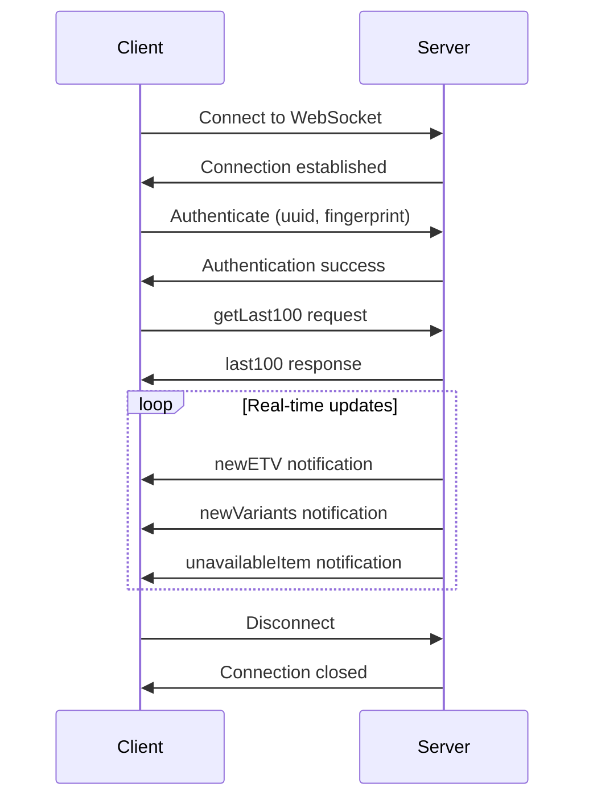

# VineHelper API Documentation

## Overview

VineHelper uses WebSocket connections to receive real-time notifications about new Amazon Vine items. This document describes the WebSocket API, message formats, and communication protocols.

## Table of Contents

1. [Connection Management](#connection-management)
2. [Authentication](#authentication)
3. [Message Types](#message-types)
4. [Request Formats](#request-formats)
5. [Response Formats](#response-formats)
6. [Error Handling](#error-handling)
7. [BroadcastChannel Messages](#broadcastchannel-messages)
8. [Rate Limiting](#rate-limiting)

## Connection Management

### WebSocket URL

```
Production: wss://api.vinehelper.ovh
Development: ws://127.0.0.1:3000
```

### Connection Lifecycle



### Reconnection Logic

- Automatic reconnection every 12 seconds if disconnected
- Exponential backoff on repeated failures
- Maximum retry attempts: 10
- Falls back to single-tab mode if WebSocket unavailable

```javascript
const WSReconnectInterval = 12 * 1000; // 12 seconds
```

## Authentication

### Authentication Parameters

When connecting, the client must provide:

```javascript
{
  "app_version": "1.2.3",           // Extension version
  "uuid": "550e8400-e29b-...",     // Unique user identifier
  "fid": "fingerprint_hash",        // Browser fingerprint
  "countryCode": "com",             // Amazon domain (com, ca, uk, etc.)
  "request_variants": true          // Premium feature flag
}
```

### Country Codes

Supported Amazon domains:

- `com` - Amazon.com (US)
- `ca` - Amazon.ca (Canada)
- `uk` - Amazon.co.uk (UK)
- `de` - Amazon.de (Germany)
- `fr` - Amazon.fr (France)
- `it` - Amazon.it (Italy)
- `es` - Amazon.es (Spain)
- `jp` - Amazon.co.jp (Japan)

## Message Types

### Client to Server Messages

#### 1. `getLast100`

Request the most recent items.

**Request:**

```javascript
{
  "type": "getLast100",
  "data": {
    "app_version": "1.2.3",
    "uuid": "550e8400-e29b-41d4-a716-446655440000",
    "fid": "fingerprint_hash",
    "countryCode": "com",
    "limit": 100,                    // Optional, default: 100
    "request_variants": true         // Optional, for premium users
  }
}
```

**Usage:**

```javascript
socket.emit("getLast100", {
	app_version: chrome.runtime.getManifest().version,
	uuid: settings.get("general.uuid"),
	fid: settings.get("general.fingerprint.id"),
	countryCode: i13n.getCountryCode(),
	limit: 100,
	request_variants: settings.isPremiumUser(2) && settings.get("general.displayVariantButton"),
});
```

### Server to Client Messages

#### 1. `last100`

Response containing the most recent items.

**Response:**

```javascript
{
  "type": "last100",
  "products": [
    {
      "asin": "B08XYZ123",
      "title": "Product Title",
      "thumbnail": "https://m.media-amazon.com/images/I/...",
      "price": "$29.99",
      "retail_price": "$39.99",
      "is_parent": false,
      "enrollment_guid": "abc-def-ghi",
      "etv": true,
      "etv_min": 20.00,
      "etv_max": 40.00,
      "queue": "encore",              // "encore", "potluck", "last_chance"
      "timestamp": "2024-01-15T10:30:00Z",
      "variants": []                  // Only if request_variants: true
    }
    // ... up to 100 items
  ]
}
```

#### 2. `newETV`

Notification for a new item with estimated tax value.

**Response:**

```javascript
{
  "type": "newETV",
  "item": {
    "asin": "B08XYZ456",
    "title": "New Product with ETV",
    "thumbnail": "https://m.media-amazon.com/images/I/...",
    "price": "$49.99",
    "retail_price": "$79.99",
    "is_parent": false,
    "enrollment_guid": "jkl-mno-pqr",
    "etv": true,
    "etv_min": 40.00,
    "etv_max": 80.00,
    "queue": "potluck",
    "timestamp": "2024-01-15T11:00:00Z"
  }
}
```

#### 3. `newVariants`

Notification for items with multiple variants.

**Response:**

```javascript
{
  "type": "newVariants",
  "item": {
    "asin": "B08PARENT1",
    "title": "Product with Variants",
    "thumbnail": "https://m.media-amazon.com/images/I/...",
    "price": "$19.99 - $29.99",
    "is_parent": true,
    "queue": "encore",
    "timestamp": "2024-01-15T11:30:00Z",
    "variants": [
      {
        "asin": "B08CHILD1",
        "title": "Variant - Blue",
        "price": "$19.99",
        "enrollment_guid": "stu-vwx-yz1"
      },
      {
        "asin": "B08CHILD2",
        "title": "Variant - Red",
        "price": "$24.99",
        "enrollment_guid": "stu-vwx-yz2"
      },
      {
        "asin": "B08CHILD3",
        "title": "Variant - Green",
        "price": "$29.99",
        "enrollment_guid": "stu-vwx-yz3"
      }
    ]
  }
}
```

#### 4. `unavailableItem`

Notification when an item is no longer available.

**Response:**

```javascript
{
  "type": "unavailableItem",
  "item": {
    "asin": "B08XYZ789",
    "reason": "out_of_stock"         // "out_of_stock", "removed", "expired"
  }
}
```

#### 5. `reloadPage`

Server request to reload/fetch a specific page.

**Response:**

```javascript
{
  "type": "reloadPage",
  "queue": "encore",                  // Which queue to reload
  "page": 1                           // Which page number
}
```

#### 6. `connection_error`

WebSocket connection error notification.

**Response:**

```javascript
{
  "type": "connection_error",
  "error": "Authentication failed",
  "code": "AUTH_FAILED",
  "retry": true,
  "retryAfter": 5000                  // Milliseconds to wait before retry
}
```

## Request Formats

### Socket.IO Event Structure

All client-to-server messages use Socket.IO's emit pattern:

```javascript
socket.emit(eventName, data);
```

### Request Headers

The WebSocket connection includes these headers:

```javascript
{
  "User-Agent": "VineHelper/1.2.3",
  "Origin": "chrome-extension://[extension-id]",
  "X-Client-Version": "1.2.3"
}
```

## Response Formats

### Standard Response Structure

All server responses follow this structure:

```javascript
{
  "type": "messageType",              // Message identifier
  "timestamp": "2024-01-15T12:00:00Z", // Server timestamp
  "data": { /* type-specific data */ }
}
```

### Item Data Structure

Standard item object format:

```javascript
{
  "asin": "B08XYZ123",               // Amazon Standard Identification Number
  "title": "Product Title",           // Item title
  "thumbnail": "https://...",         // Thumbnail image URL
  "price": "$29.99",                  // Display price
  "retail_price": "$39.99",           // Original retail price
  "is_parent": false,                 // Has variants
  "enrollment_guid": "abc-def-ghi",   // Unique enrollment ID
  "etv": true,                        // Has estimated tax value
  "etv_min": 20.00,                   // Minimum ETV (number)
  "etv_max": 40.00,                   // Maximum ETV (number)
  "queue": "encore",                  // Queue type
  "timestamp": "2024-01-15T10:30:00Z", // When item was found
  "variants": []                      // Child variants (if parent)
}
```

### Queue Types

- `encore` - Regular Vine items
- `potluck` - Potluck/lottery items
- `last_chance` - Items about to expire

## Error Handling

### Error Response Format

```javascript
{
  "type": "error",
  "error": {
    "code": "ERROR_CODE",
    "message": "Human-readable error message",
    "details": { /* Additional error context */ },
    "retry": true,
    "retryAfter": 5000
  }
}
```

### Error Codes

| Code                    | Description                | Retry |
| ----------------------- | -------------------------- | ----- |
| `AUTH_FAILED`           | Authentication failed      | Yes   |
| `RATE_LIMIT`            | Rate limit exceeded        | Yes   |
| `INVALID_REQUEST`       | Malformed request          | No    |
| `SERVER_ERROR`          | Internal server error      | Yes   |
| `MAINTENANCE`           | Server maintenance         | Yes   |
| `UNSUPPORTED_VERSION`   | Client version too old     | No    |
| `COUNTRY_NOT_SUPPORTED` | Country code not supported | No    |

### Client Error Handling

```javascript
socket.on("connection_error", (error) => {
	console.error("WebSocket error:", error.message);

	if (error.code === "AUTH_FAILED") {
		// Re-authenticate
		refreshAuthentication();
	} else if (error.code === "RATE_LIMIT") {
		// Wait and retry
		setTimeout(() => reconnect(), error.retryAfter);
	}
});
```

## BroadcastChannel Messages

Internal communication between extension components uses BroadcastChannel.

### Channel Name

```javascript
const channel = new BroadcastChannel("vinehelper");
```

### Internal Message Types

#### 1. WebSocket Status

```javascript
{
  "type": "wsStatus",
  "status": "wsConnected" | "wsError" | "wsClosed",
  "error": "Error message (if applicable)"
}
```

#### 2. Master/Slave Coordination

```javascript
// Master announcement
{
  "type": "masterAlive",
  "monitorId": "uuid-of-master",
  "timestamp": Date.now()
}

// Slave registration
{
  "type": "slaveRegister",
  "monitorId": "uuid-of-slave"
}

// Master election
{
  "type": "requestMaster",
  "monitorId": "uuid-requesting"
}
```

#### 3. Item Broadcasting

```javascript
// Broadcast new items to all tabs
{
  "type": "newItems",
  "items": [ /* array of item objects */ ],
  "source": "master"
}

// Item removal broadcast
{
  "type": "removeItems",
  "asins": ["B08XYZ123", "B08XYZ456"],
  "reason": "unavailable"
}
```

#### 4. Settings Synchronization

```javascript
{
  "type": "settingsChanged",
  "changes": {
    "general.hideKeywords": ["keyword1", "keyword2"],
    "notification.active": true
  }
}
```

## Rate Limiting

### Limits

- **getLast100**: 1 request per 10 seconds
- **WebSocket connections**: 5 concurrent per user
- **Total requests**: 1000 per hour

### Rate Limit Response

```javascript
{
  "type": "error",
  "error": {
    "code": "RATE_LIMIT",
    "message": "Rate limit exceeded",
    "limit": 1000,
    "remaining": 0,
    "reset": 1705325400000,          // Unix timestamp
    "retryAfter": 3600000             // Milliseconds
  }
}
```

### Client Rate Limit Handling

```javascript
class RateLimiter {
	constructor() {
		this.requests = new Map();
		this.limits = {
			getLast100: { count: 1, window: 10000 },
			default: { count: 100, window: 60000 },
		};
	}

	canRequest(type) {
		const limit = this.limits[type] || this.limits.default;
		const key = `${type}:${Math.floor(Date.now() / limit.window)}`;
		const count = this.requests.get(key) || 0;

		if (count >= limit.count) {
			return false;
		}

		this.requests.set(key, count + 1);
		return true;
	}
}
```

## Usage Examples

### Complete Connection Flow

```javascript
import { io } from "socket.io-client";

class VineHelperAPI {
	constructor(settings, i13n) {
		this.settings = settings;
		this.i13n = i13n;
		this.socket = null;
	}

	connect() {
		const url = "wss://api.vinehelper.ovh";

		this.socket = io(url, {
			transports: ["websocket"],
			reconnection: true,
			reconnectionDelay: 12000,
			reconnectionAttempts: 10,
		});

		this.setupEventHandlers();
		this.authenticate();
	}

	setupEventHandlers() {
		this.socket.on("connect", () => {
			console.log("WebSocket connected");
			this.requestLatestItems();
		});

		this.socket.on("last100", (data) => {
			this.processItems(data.products);
		});

		this.socket.on("newETV", (data) => {
			this.processNewItem(data.item);
		});

		this.socket.on("unavailableItem", (data) => {
			this.removeItem(data.item.asin);
		});

		this.socket.on("connection_error", (error) => {
			this.handleError(error);
		});
	}

	authenticate() {
		// Authentication happens with getLast100 request
	}

	requestLatestItems(limit = 100) {
		if (!this.socket?.connected) return;

		this.socket.emit("getLast100", {
			app_version: chrome.runtime.getManifest().version,
			uuid: this.settings.get("general.uuid"),
			fid: this.settings.get("general.fingerprint.id"),
			countryCode: this.i13n.getCountryCode(),
			limit: limit,
			request_variants: this.settings.isPremiumUser(2),
		});
	}

	disconnect() {
		if (this.socket) {
			this.socket.disconnect();
			this.socket = null;
		}
	}
}
```

### Error Recovery

```javascript
class ConnectionManager {
	constructor(api) {
		this.api = api;
		this.retryCount = 0;
		this.maxRetries = 10;
	}

	handleConnectionError(error) {
		if (error.code === "AUTH_FAILED") {
			// Clear stored credentials and re-authenticate
			this.clearCredentials();
			this.authenticate();
		} else if (error.code === "RATE_LIMIT") {
			// Schedule retry after rate limit window
			setTimeout(() => {
				this.api.connect();
			}, error.retryAfter || 60000);
		} else if (error.retry && this.retryCount < this.maxRetries) {
			// Exponential backoff
			const delay = Math.min(1000 * Math.pow(2, this.retryCount), 60000);
			this.retryCount++;

			setTimeout(() => {
				this.api.connect();
			}, delay);
		} else {
			// Max retries reached or non-retryable error
			this.fallbackToOfflineMode();
		}
	}
}
```

## Security Considerations

1. **Authentication**: UUID and fingerprint should be securely generated and stored
2. **Transport**: Always use WSS (WebSocket Secure) in production
3. **Validation**: Validate all incoming messages before processing
4. **Rate Limiting**: Implement client-side rate limiting to avoid server bans
5. **Error Handling**: Never expose sensitive information in error messages

## Versioning

The API uses the extension version for compatibility checks:

- Minimum supported version: 1.0.0
- Current version: Check manifest.json
- Version header: `X-Client-Version`

Breaking changes will result in `UNSUPPORTED_VERSION` errors.
