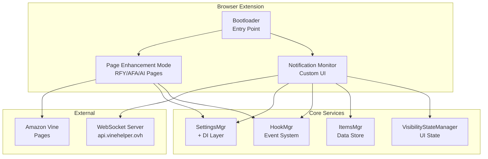
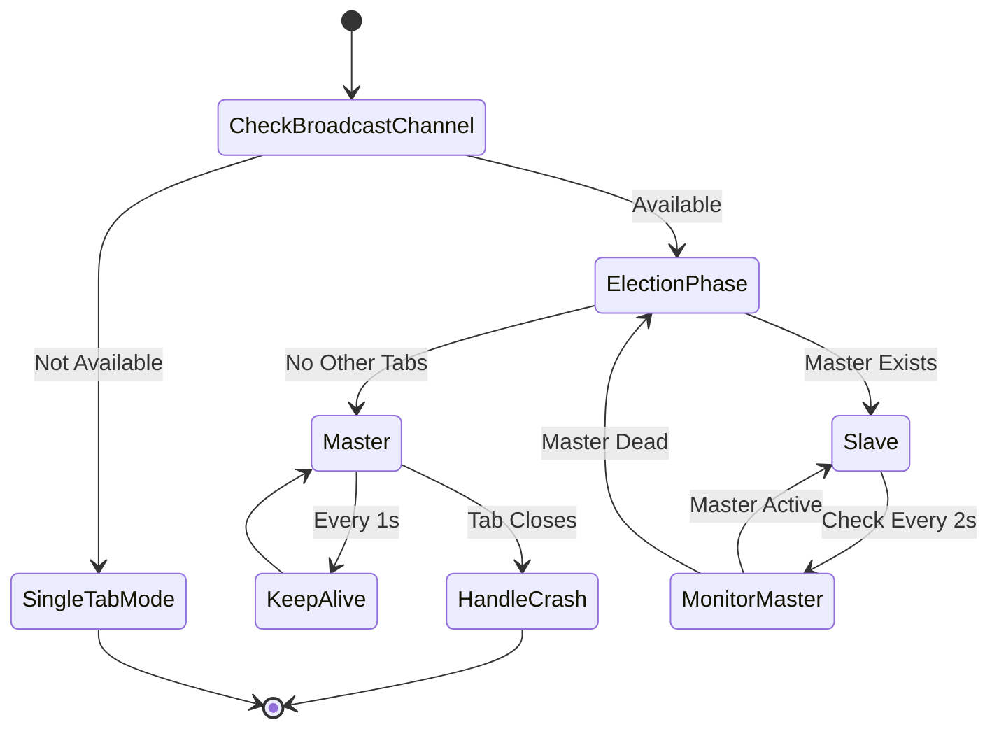
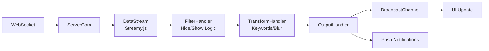
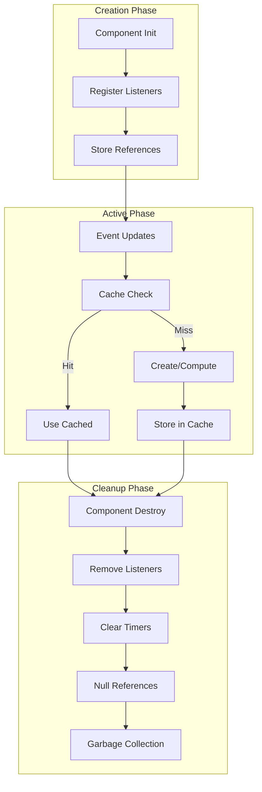
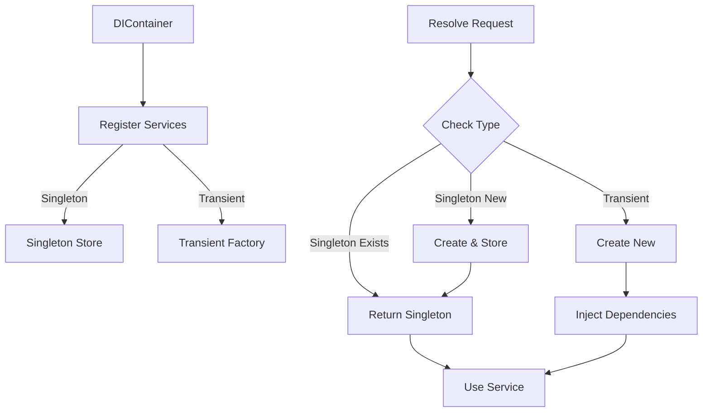

# VineHelper Architecture Overview

## Project Structure

VineHelper is a browser extension that enhances the Amazon Vine experience. The codebase reveals several architectural patterns and areas for improvement.

## System Architecture Diagram



## Current Architecture

### Core Components

1. **Bootloader System** (`scripts/bootloader.js`)

    - Initializes all singleton instances
    - Sets up the environment and dependencies
    - Creates grid instances and manages tabs
    - Heavy coupling with global state
    - **Enhances Amazon Vine pages** (RFY, AFA, AI tabs) with:
        - Tile and Toolbar components
        - Order status tracking (success/failed counts)
        - Hidden/Pinned item management
        - Direct DOM manipulation of existing Amazon elements

2. **Notifications Monitor** (`scripts/notification_monitor/`)

    - Complex subsystem with multiple components
    - Master/Slave architecture for multi-tab coordination
    - Stream-based processing for new items
    - Version-specific implementations (V2, V3)
    - **Separate from bootloader system** - creates its own:
        - Custom tile rendering system
        - Independent grid management
        - No order status tracking (by design)
        - Complete UI replacement, not enhancement

3. **Settings Management** (`scripts/SettingsMgr.js`)

    - Dependency injection pattern with StorageAdapter
    - Migration from singleton pattern in progress
    - Array caching for stable references
    - Keyword pre-compilation support

4. **UI Components**
    - **Grid System**: Manages product tiles across different tabs
    - **Tile System**: Individual product representation
        - Bootloader tiles: Enhance existing Amazon tiles
        - Monitor tiles: Custom-built from scratch
    - **Toolbar**: Product-specific actions (only in bootloader-enhanced pages)
    - **Modal Management**: Dynamic modal creation

### System Boundaries

**Important Distinction**: VineHelper operates in two distinct modes:

1. **Page Enhancement Mode** (Bootloader):

    - Runs on Amazon Vine pages (RFY, AFA, AI)
    - Enhances existing Amazon UI elements
    - Adds toolbars with order tracking, pinning, hiding
    - Preserves Amazon's tile structure

2. **Custom Interface Mode** (Notification Monitor):
    - Completely custom UI
    - Independent tile rendering system
    - No integration with Amazon's DOM structure
    - Focused on real-time notifications

These systems share some services (Settings, Environment) but have separate rendering pipelines and feature sets.

### Architectural Patterns

1. **Singleton Pattern (Overused)**

    - Almost every major component is a singleton
    - Makes testing difficult
    - Creates tight coupling

2. **Event-Driven Architecture**

    - Hook system for extensibility
    - Browser message passing
    - DOM event handling
    - **GridEventManager** for centralized grid modifications
    - Event batching for performance optimization

3. **Stream Processing**
    - `Streamy.js` provides functional stream processing
    - Used in notification processing pipeline

## Notification Monitor Architecture

### Overview

The Notification Monitor is a real-time item tracking system that displays Amazon Vine items as they become available. It uses a master/slave architecture to coordinate between multiple browser tabs and efficiently manage resources.

### Multi-Tab Coordination

#### Master-Slave Architecture

The notification monitor uses a master-slave pattern for multi-tab coordination:

- One tab acts as the "master" and performs all server communication
- Other tabs act as "slaves" and display data received from the master
- Coordination happens via BroadcastChannel API



#### Design Trade-offs

1. **Item Count Synchronization**: Each tab maintains its own count to avoid complex state sync. This means counts may differ between tabs, but actual item processing is properly coordinated.
2. **Single Point of Failure**: If the master tab crashes, a slave automatically promotes itself to master within 2 seconds.
3. **Browser Compatibility**: Falls back to single-tab mode if BroadcastChannel is unavailable.

### Known Limitations

#### Multi-Tab Item Count Synchronization

When using VineHelper across multiple browser tabs, item counts are not synchronized between tabs. This is a deliberate design decision to avoid the complexity of real-time state synchronization across tabs. While the actual item processing is properly coordinated (preventing duplicates), each tab maintains its own view of the item count.

**Impact**: Users may see different counts in different tabs, but this does not affect the core functionality of item processing.

**Future Improvement**: A future enhancement could implement count synchronization using the existing BroadcastChannel infrastructure, but this would require careful handling of race conditions and state conflicts.

### Architecture Components

#### 1. Master/Slave Coordination

- **MasterSlave.js**: Manages which monitor instance acts as master
- Only the master fetches items from the server
- Slave monitors receive items via BroadcastChannel
- Automatic failover if master tab closes

#### 2. Core Components

**MonitorCore.js**

- Base class for all monitor types
- Initializes core services (settings, hooks, etc.)
- Manages master/slave state transitions
- Creates WebSocket and AutoLoad instances for master

**NotificationMonitor.js**

- Main monitor implementation
- Handles item display and filtering
- Manages UI interactions
- Processes incoming items

**NotificationMonitorV3.js**

- Enhanced version with dependency injection
- Uses DIContainer for service management
- Implements advanced features like NoShiftGrid

#### 3. Data Flow

```
WebSocket Server
    ↓
Master Monitor (V3)
    ├─→ WebSocket.js (receives items)
    ├─→ ServerCom.js (processes items)
    ├─→ Stream Processing
    └─→ BroadcastChannel
            ↓
    Slave Monitors (V2)
```

#### Notification Processing Pipeline



#### 4. Visibility Management

**VisibilityStateManager**
Centralized service managing both:

- **Element Visibility**: Tracks which items are visible/hidden
- **Count Management**: Maintains accurate count of visible items
- **Performance**: WeakMap caching, batch operations
- **Events**: Emits visibility changes for UI updates

Key features:

- `setVisibility()`: Update element visibility with automatic count tracking
- `isVisible()`: Check visibility with caching
- `batchSetVisibility()`: Batch operations for performance
- `recalculateCount()`: Full recount from DOM

### Performance Optimizations

1. **Batch Operations**: Reduces DOM reflows from O(n) to O(1)
2. **WeakMap Caching**: Prevents memory leaks, caches computed styles
3. **Event Debouncing**: Batches rapid UI updates
4. **Efficient Processing**: Optimized stream processing for large batches
5. **Stream Processing**: Handles large item batches efficiently

## Memory Management

### Memory Management Lifecycle



### Fixed Issues

#### Critical Issues (Unbounded Growth)

1. **Uncleared Interval in MasterSlave** ✅ FIXED

    - 1-second interval never cleared
    - Added proper cleanup in destroy()

2. **Uncleared Interval in ServerCom** ✅ FIXED

    - 10-second service worker check never cleared
    - Added destroy() method

3. **NotificationMonitor Instance Leak** ✅ FIXED

    - Multiple instances retained in memory
    - Added cleanup in bootloader.js

4. **KeywordMatch Object Retention** ✅ FIXED
    - Uses WeakMap + counter approach for cache keys
    - Caches up to 10 different keyword arrays (not individual keywords)
    - Each array pre-compiles all its keywords together
    - Automatic cleanup of oldest arrays when limit exceeded

#### Performance Issues

1. **Keyword Matching Performance** ✅ FIXED

    - 15x improvement (19.4s → 1.3s)
    - WeakMap + counter approach for cache keys
    - Module-level caching

2. **Stream Processing Memory Usage** ✅ FIXED
    - 95% memory reduction (1.6 MB → 69.2 KB)
    - Named functions and cached settings

### Best Practices

1. **Memory Monitoring**

    - Enable via Settings > General > Debugging > Memory Analysis
    - Available as `VH_MEMORY` in console
    - Automatic snapshots and leak detection

2. **Cleanup Lifecycle Pattern**

    - Every class must implement destroy() method
    - Track and clean all event listeners
    - Clear timers and intervals

3. **WeakMap for DOM Associations**

    ```javascript
    const elementData = new WeakMap();
    // Data automatically garbage collected when element is removed
    ```

4. **Event Listener Management**
    - Store handler references before adding
    - Always remove listeners in destroy()
    - Use event delegation for dynamic content

### Prevention Guidelines

1. **Always store handler references** - Never use anonymous functions in addEventListener
2. **Always remove listeners** - Implement destroy() methods in all services
3. **Use event delegation** - For dynamic content like tiles
4. **Clear references** - Null out data and handlers when removing elements
5. **Clear timers** - Store and clear all setInterval/setTimeout IDs
6. **Use WeakMap/WeakSet** - For DOM references where possible

## Dependency Injection Migration

### Overview

The dependency injection refactoring introduces:

- A lightweight DI container (`DIContainer.js`)
- Storage adapters for testability (`StorageAdapter.js`)
- A refactored SettingsMgr that accepts dependencies (`SettingsMgrDI.js`)
- A compatibility layer for gradual migration (`SettingsMgrCompat.js`)

### Dependency Injection Flow



### Migration Status

✅ **Completed**

- DIContainer with singleton/transient support
- StorageAdapter abstraction (Chrome and Memory implementations)
- SettingsMgr refactored to use dependency injection
- Compatibility layer for gradual migration
- Comprehensive unit tests for DI components

🔧 **In Progress**

- Logger service migration
- Browser API adapters
- Testing infrastructure

📋 **Planned**

- HiddenListMgr and PinnedListMgr migration
- Extract business logic into services
- Refactor notifications monitor
- Complete bootloader refactoring

## Implementation Guidelines

### Critical Implementation Guidelines

1. **Visibility State Changes**: Any operation that might change item visibility MUST:

    - Track the visibility state before and after the operation
    - Emit appropriate grid events when visibility changes
    - Update the VisibilityStateManager count accordingly

    **Operations requiring visibility tracking:**

    - `addTileInGrid()` - when updating existing items
    - `setTierFromASIN()` - when tier changes affect visibility
    - `#bulkRemoveItems()` - count visible items being removed
    - `#clearAllVisibleItems()` - remove only visible items
    - `#clearUnavailableItems()` - delegates to bulkRemoveItems for proper counting
    - `#handlePauseClick()` - recalculate count after unpause
    - Any filtering operations (search, type, queue filters)

2. **Event Batching**: Use batching for performance-sensitive operations:

    - Placeholder updates: 50ms batch delay
    - Tab title updates: 100ms batch delay
    - Prevents UI thrashing during rapid updates

3. **Testing Strategy**:

    - Write tests that verify behavior, not implementation
    - Include edge cases and browser-specific scenarios
    - Ensure tests remain maintainable as implementation evolves

4. **Safari Compatibility**:
    - Use `window.getComputedStyle()` for Safari
    - Use `element.style.display` for other browsers
    - Always check browser type when accessing display styles

## Technical Debt Priorities

1. **Bootloader Refactoring** - High risk, high reward
2. **Singleton Elimination** - Medium risk, high reward
3. **Monster Class Breakdown** - Low risk, medium reward
4. **Folder Reorganization** - Low risk, low reward

## Future Improvements

### High Priority

1. **HookMgr Enhancement**

    - Implement unbind functionality for event listeners
    - Prevent memory leaks in GridEventManager

2. **Virtual Scrolling**
    - Only render visible items
    - Constant memory usage regardless of item count
    - Better initial load times

### Medium Priority

1. **Event System Improvements**

    - Implement event batching for performance
    - Create typed event system
    - Add event debugging capabilities

2. **Service Layer Extraction**
    - Filter management service
    - Sort operations service
    - Settings caching layer

### Low Priority

1. **Advanced Filtering System**

    - Multi-criteria filtering
    - Custom filter expressions
    - Filter presets and saving

2. **Performance Monitoring**
    - Built-in performance metrics
    - User experience tracking
    - Automated performance regression detection
