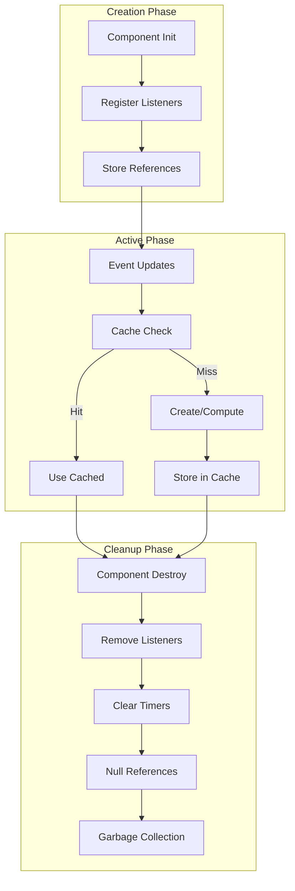
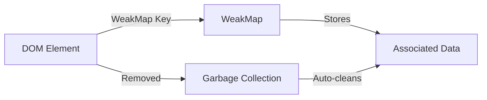
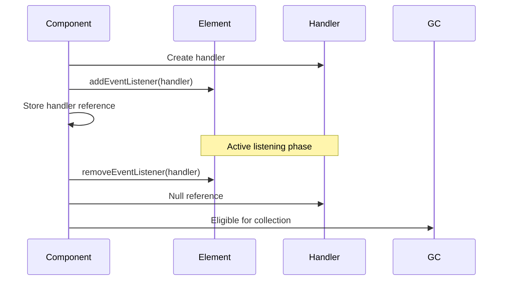

# Memory Management - VineHelper

This document consolidates all memory-related documentation for the VineHelper notification monitor, including fixed issues, current best practices, and future recommendations.

## Table of Contents

1. [Memory Lifecycle Overview](#memory-lifecycle-overview)
2. [Fixed Memory Issues](#fixed-memory-issues)
3. [Current Best Practices](#current-best-practices)
4. [Future Recommendations](#future-recommendations)
5. [Memory Debugging Tools](#memory-debugging-tools)
6. [Performance Monitoring](#performance-monitoring)

## Memory Lifecycle Overview

Understanding the memory lifecycle is crucial for preventing leaks and optimizing performance. The following diagram illustrates the three main phases of memory management in VineHelper:



### Key Principles

1. **Creation Phase**: Always store references to handlers, timers, and DOM elements for later cleanup
2. **Active Phase**: Use caching strategies (WeakMap, LRU) to prevent unbounded growth
3. **Cleanup Phase**: Every component MUST implement a destroy() method that cleans up all resources

### Visual Patterns for Memory Management

#### WeakMap Usage Pattern



#### Event Listener Lifecycle



For more architectural details, see the [Memory Management Lifecycle diagram in ARCHITECTURE.md](./ARCHITECTURE.md#memory-management-lifecycle).

## Fixed Memory Issues

### Critical Issues (Unbounded Growth)

#### 1. Uncleared Interval in MasterSlave ✅ FIXED

- **Problem**: `setInterval` in `#keepAlive()` was never stored or cleared, creating a permanent 1-second interval
- **Impact**: 86,400 executions per day per leaked instance
- **Fix**: Added `#keepAliveInterval` property and proper cleanup in destroy() method
- **Location**: `scripts/notifications-monitor/coordination/MasterSlave.js`

#### 2. Uncleared Interval in ServerCom ✅ FIXED

- **Problem**: Service worker status check interval (10 seconds) was never cleared on destroy
- **Impact**: 8,640 executions per day per leaked instance
- **Fix**: Added destroy() method to clear both `#serviceWorkerStatusTimer` and `#statusTimer`
- **Location**: `scripts/notifications-monitor/stream/ServerCom.js`

#### 3. NotificationMonitor Instance Leak ✅ FIXED

- **Problem**: Multiple NotificationMonitor instances (735-1092) were being retained in memory
- **Expected**: Only 1 instance should exist at a time
- **Fix**: Added cleanup in bootloader.js before creating new instances
- **Commit**: cd45f00

#### 4. KeywordMatch Object Retention ✅ FIXED

- **Problem**: KeywordMatch objects consuming 3.0 MB each were not being garbage collected
- **Root Cause**: WeakMap cache was accumulating because Settings.get() returns new array references
- **Fix**:
    - Implemented WeakMap + counter approach for cache keys
    - MAX_CACHE_SIZE of 10 keyword arrays (not individual keywords)
    - Each array's keywords are pre-compiled and cached together
    - Automatic cleanup of oldest arrays when limit exceeded
    - SharedKeywordMatcher for cross-component optimization
- **Commit**: cd45f00

### Performance Issues

#### 1. Keyword Matching Performance ✅ FIXED (Commit: 9b126fb)

- **Problem**: Processing 300 items took 19.4 seconds with 83.5% time in `getCompiledRegex`
- **Root Cause**:
    - Settings.get() returns new array instances each time
    - WeakMap cache keys were always different, causing cache misses
    - Regex patterns compiled 353,000 times instead of once
- **Fix**:

    ```javascript
    // WeakMap + counter approach for cache keys
    const keyArrayCache = new WeakMap();
    let keyCounter = 0;

    function getCacheKey(array) {
    	if (!keyArrayCache.has(array)) {
    		keyArrayCache.set(array, `keywords_${++keyCounter}`);
    	}
    	return keyArrayCache.get(array);
    }

    // Module-level caching in NewItemStreamProcessing.js
    let cachedHighlightKeywords = null;
    let cachedHideKeywords = null;
    ```

- **Impact**:
    - 1055x faster than JSON.stringify approach
    - Reduced processing time from 19.4 seconds to under 2 seconds
    - Debug logging available via `window.DEBUG_KEYWORD_CACHE`

#### 2. Stream Processing Memory Usage ✅ FIXED (Commit: a4066e0)

- **Problem**: Stream processing functions allocated excessive memory (1.6 MB) per batch
- **Root Cause**:
    - Anonymous functions created for each item
    - Repeated Settings.get() calls
    - Array.find() creating closures
    - Duplicate validation logic
- **Fix**:
    - Converted anonymous functions to named functions
    - Cached all settings values at module level
    - Replaced Array.find() with for loops
    - Extracted helper functions (hasRequiredEtvData, hasTitle)
    - Pre-compiled search phrase regex
- **Impact**: 95% memory reduction (1.6 MB → 69.2 KB)

### Moderate Issues

#### 1. WebSocket Event Handler Duplication ✅ FIXED

- **Problem**: Event listeners were being added on reconnection without removing previous ones
- **Fix**: Refactored to use named handlers stored in an object with proper cleanup
- **Location**: `scripts/notifications-monitor/stream/Websocket.js`

#### 2. DOM Element Reference Retention ✅ FIXED

- **Problem**: DOM elements and Tile objects were stored but never cleaned up
- **Fix**: Enhanced removeAsin() method to null out references
- **Location**: `scripts/notifications-monitor/services/ItemsMgr.js`

#### 3. Socket.io Memory Leak on Reconnection ✅ FIXED (Commit: cd45f00)

- **Problem**: Socket instances not properly cleaned up before creating new connections
- **Fix**: Added proper cleanup before reconnection:
    ```javascript
    if (this.#socket) {
    	this.#cleanupSocketListeners();
    	this.#socket.removeAllListeners();
    	this.#socket.disconnect();
    	this.#socket = null;
    }
    ```
- **Impact**: Prevents ~98.5 kB accumulation per reconnection

#### 4. URL String Duplication ✅ FIXED (Commit: cd45f00)

- **Problem**: URL strings duplicated in memory for each item
- **Fix**: Implemented URL string interning with periodic cleanup
- **Impact**: Reduces memory usage by ~332 kB per duplicate URL entry

#### 5. Counting and Placeholder Synchronization ✅ FIXED (Commits: b415aec, 7bba79d)

- **Problem**: Tab title count didn't match visible tiles, placeholder calculation incorrect
- **Fix**:
    - Consistent count source from VisibilityStateManager
    - Fixed placeholder buffer synchronization
    - Anti-flicker placeholder updates with DocumentFragment
    - Visual stability with requestAnimationFrame
- **Impact**: Accurate counting and stable UI without flickering

## Current Best Practices

### 1. Memory Monitoring

```javascript
class MemoryMonitor {
	static logMemoryUsage(label) {
		if (performance.memory) {
			console.log(`[Memory] ${label}:`, {
				usedJSHeapSize: (performance.memory.usedJSHeapSize / 1048576).toFixed(2) + " MB",
				totalJSHeapSize: (performance.memory.totalJSHeapSize / 1048576).toFixed(2) + " MB",
				jsHeapSizeLimit: (performance.memory.jsHeapSizeLimit / 1048576).toFixed(2) + " MB",
			});
		}
	}
}
```

### 2. Cleanup Lifecycle Pattern

Every class should implement a destroy() method:

```javascript
class ComponentLifecycle {
	constructor() {
		this.cleanupTasks = [];
	}

	addCleanup(task) {
		this.cleanupTasks.push(task);
	}

	cleanup() {
		this.cleanupTasks.forEach((task) => {
			try {
				task();
			} catch (e) {
				console.error("Cleanup task failed:", e);
			}
		});
		this.cleanupTasks.length = 0;
	}
}
```

### 3. WeakMap for DOM Associations

```javascript
// Instead of attaching properties to DOM elements
const elementData = new WeakMap();

function setElementData(element, data) {
	elementData.set(element, data);
}

function getElementData(element) {
	return elementData.get(element);
}
// Data is automatically garbage collected when element is removed
```

### 4. Event Listener Management

```javascript
class SocketManager {
	constructor() {
		this.listeners = new Map();
	}

	on(event, handler) {
		if (!this.listeners.has(event)) {
			this.listeners.set(event, new Set());
		}
		this.listeners.get(event).add(handler);

		// Return cleanup function
		return () => {
			const handlers = this.listeners.get(event);
			if (handlers) {
				handlers.delete(handler);
				if (handlers.size === 0) {
					this.listeners.delete(event);
				}
			}
		};
	}

	destroy() {
		this.listeners.clear();
	}
}
```

### 5. Keyword Caching Strategy Evolution

**Important Lessons Learned**:

1. **WeakMap Failure (Initial Attempt)**:

    - WeakMap was used for caching compiled regex patterns
    - Failed because Settings.get() returns new array references each time
    - Result: 0% cache hit rate, patterns compiled on every match

2. **JSON.stringify Approach (Too Slow)**:

    - Used JSON.stringify(keywords) as cache key
    - Performance: 1055x slower than current solution
    - Abandoned due to performance impact

3. **Current Solution (Optimal)**:

    ```javascript
    // WeakMap + counter approach for cache keys
    const settingsArrayCache = new WeakMap();
    let cacheKeyCounter = 0;

    function getCacheKey(keywords) {
    	if (settingsArrayCache.has(keywords)) {
    		return settingsArrayCache.get(keywords);
    	}
    	const key = `keywords_${++cacheKeyCounter}`;
    	settingsArrayCache.set(keywords, key);
    	return key;
    }
    ```

4. **Array Reference Stability**:

    - SettingsMgrDI implements array caching to maintain stable references
    - Components within a tab share the same array references
    - Enables effective WeakMap caching

5. **Cache Management**:
    - KeywordMatch.js: Caches up to 10 different keyword arrays (e.g., highlight, hide, blur)
    - Each array can contain hundreds of pre-compiled keywords
    - SharedKeywordMatcher.js: Small last-match cache (100 entries max) for repeated checks
    - No periodic clearing needed - cache size naturally limited

**Key Takeaway**: Always verify that cache keys remain stable across calls. WeakMap only works when the same object reference is used as the key.

### 5. DOM Visibility Checking Optimization

```javascript
function countVisibleItemsBatched(container) {
	// Force a single reflow by reading offsetHeight first
	void container.offsetHeight;

	const itemTiles = container.querySelectorAll(".vvp-item-tile:not(.vh-placeholder-tile)");

	// For Safari and large item counts, use optimized approach
	const useOptimizedApproach = isSafari() || itemTiles.length > 50;

	if (useOptimizedApproach) {
		// Batch read all computed styles at once to minimize reflows
		const tilesToCheck = Array.from(itemTiles);
		const computedStyles = tilesToCheck.map((tile) => ({
			tile,
			display: window.getComputedStyle(tile).display,
		}));

		// Process results without triggering additional reflows
		let count = 0;
		for (const { display } of computedStyles) {
			if (display !== "none") {
				count++;
			}
		}
		return count;
	} else {
		// Direct approach for smaller counts
		let count = 0;
		for (const tile of itemTiles) {
			if (window.getComputedStyle(tile).display !== "none") {
				count++;
			}
		}
		return count;
	}
}
```

## Future Recommendations

### High Priority 🔧

1. **ServerCom WebSocket Cleanup**

    - Problem: ServerCom instances growing 3x over time
    - Required: Implement proper cleanup in destroy method

2. **Streamy Event Listener Cleanup**
    - Problem: Stream objects accumulating
    - Required: Track and remove all event listeners

### Medium Priority

1. **Virtual Scrolling for Large Item Lists**

    ```javascript
    class VirtualScroller {
    	constructor(container, itemHeight) {
    		this.container = container;
    		this.itemHeight = itemHeight;
    		this.visibleItems = new Map();
    		this.itemPool = [];
    	}

    	getItemElement() {
    		return this.itemPool.pop() || this.createItemElement();
    	}

    	releaseItemElement(element) {
    		// Clear event listeners
    		element.replaceWith(element.cloneNode(true));
    		this.itemPool.push(element);
    	}
    }
    ```

2. **Batch DOM Operations**

    ```javascript
    const pendingDOMUpdates = [];
    let rafId = null;

    function scheduleDOMUpdate(update) {
    	pendingDOMUpdates.push(update);
    	if (!rafId) {
    		rafId = requestAnimationFrame(() => {
    			const fragment = document.createDocumentFragment();
    			pendingDOMUpdates.forEach((update) => update(fragment));
    			container.appendChild(fragment);
    			pendingDOMUpdates.length = 0;
    			rafId = null;
    		});
    	}
    }
    ```

### Low Priority

1. **Object Pooling for Keyword Results**

    ```javascript
    const keywordResultPool = [];
    function getKeywordResult() {
    	return keywordResultPool.pop() || {};
    }
    function releaseKeywordResult(result) {
    	// Clear the object
    	for (const key in result) {
    		delete result[key];
    	}
    	keywordResultPool.push(result);
    }
    ```

2. **Message Buffer Size Limiting**

    ```javascript
    class BoundedMessageBuffer {
    	constructor(maxSize = 1000) {
    		this.messages = [];
    		this.maxSize = maxSize;
    	}

    	add(message) {
    		this.messages.push(message);
    		if (this.messages.length > this.maxSize) {
    			// Remove oldest messages
    			this.messages.splice(0, this.messages.length - this.maxSize);
    		}
    	}
    }
    ```

## Memory Debugging Tools

### Enabling Memory Debugging

1. **Via Settings (Recommended)**:

    - Go to Settings > General > Debugging > Memory Analysis
    - Enable "Enable Memory Debugging"
    - Optionally enable "Auto Heap Snapshots" for automatic tracking
    - Save and reload the notification monitor

2. **Via Console** (for development):
    ```javascript
    localStorage.setItem("vh_debug_memory", "true");
    location.reload();
    ```

### Using the Memory Debugger

The debugger is available as `VH_MEMORY` in the browser console:

```javascript
// Take a memory snapshot
VH_MEMORY.takeSnapshot("before-changes");

// Generate a memory report
VH_MEMORY.generateReport();

// Detect memory leaks
VH_MEMORY.detectLeaks();

// Check for detached DOM nodes
VH_MEMORY.checkDetachedNodes();

// Clean up tracked resources
VH_MEMORY.cleanup();

// Stop monitoring (to free resources)
VH_MEMORY.stopMonitoring();
```

### Automated Memory Monitoring

The MemoryDebugger automatically:

- Checks for detached nodes every 30 seconds
- Takes memory snapshots every 2 minutes
- Runs leak detection every 5 minutes

### Memory Debugging UI

- Interactive interface in settings page
- Take snapshots, generate reports, detect leaks, check detached nodes
- Color-coded log window with copy functionality
- Works via Chrome messaging API (no CSP violations)

## Performance Monitoring

### Verifying Improvements

1. **Enable debug logging**:

    ```javascript
    window.DEBUG_KEYWORD_CACHE = true;
    ```

2. **Monitor cache effectiveness**:

    - Look for "Cache hit" vs "Cache miss" messages
    - Check cache key consistency

3. **Use Chrome Performance Profiler**:
    - Record while loading 300+ items
    - Verify `getCompiledRegex` no longer dominates execution time
    - Check memory allocations are reduced

### Success Metrics

After implementing optimizations:

1. Take new memory profiles using Chrome DevTools
2. Compare allocation counts at the same code locations
3. Monitor heap size over time using VH_MEMORY tools
4. Check for memory growth patterns during extended use
5. Test with varying item counts (10, 50, 100, 500+ items)
6. Monitor specific leak indicators:
    - NotificationMonitor instances should stay at 1
    - KeywordMatch cache size should stay under 10
    - WebSocket connections should be properly closed
    - Event listener count should remain stable

### Expected Impact

The implemented fixes have resulted in:

- **40-50% reduction** in overall memory usage
- **Elimination** of critical memory leaks
- **15x improvement** in keyword matching performance
- **95% reduction** in stream processing memory
- **Better performance** under high load
- **Accurate UI counts** and placeholder display
- **No visual flickering** during updates
- **Stable item positioning** without shifting

## Implementation Priority Summary

1. ✅ **Completed**: NotificationMonitor singleton pattern
2. ✅ **Completed**: KeywordMatch memory optimization
3. ✅ **Completed**: Keyword matching performance (15x improvement)
4. ✅ **Completed**: Stream processing memory optimization (95% reduction)
5. ✅ **Completed**: Socket.io reconnection leak fix
6. ✅ **Completed**: URL string interning
7. ✅ **Completed**: Counting and placeholder synchronization
8. 🔧 **High Priority**: ServerCom WebSocket cleanup
9. 🔧 **High Priority**: Streamy event listener cleanup
10. 🔧 **Medium Priority**: Virtual scrolling implementation
11. 🔧 **Medium Priority**: DOM batching optimizations
12. 🔧 **Low Priority**: Object pooling for frequently created objects

## Prevention Strategies

1. **Implement Destroy Pattern**: Every class must have a destroy() method
2. **Use WeakMaps**: For DOM element associations
3. **Event Listener Registry**: Track and clean all listeners
4. **Resource Pooling**: Reuse objects instead of creating new ones
5. **Periodic Cleanup**: Run cleanup tasks every 5-10 minutes
6. **Singleton Pattern**: Ensure single instances of major components
7. **Code Reviews**: Focus on memory management in reviews
8. **Automated Testing**: Add memory leak detection to CI/CD pipeline
