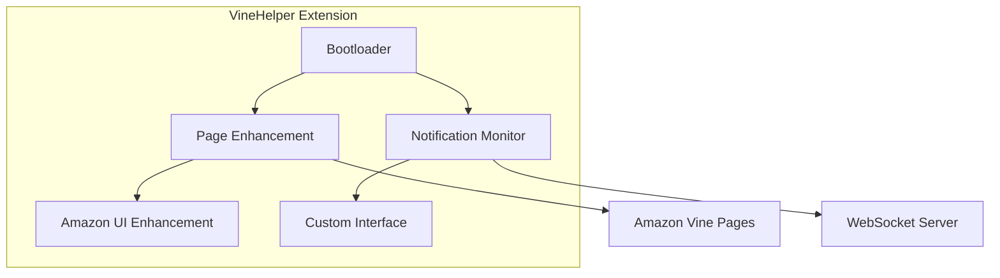

# VineHelper Documentation

Welcome to the VineHelper documentation! This guide will help you understand, use, and contribute to the VineHelper browser extension.

## 📚 Documentation Index

### Getting Started

- [**README**](../README.md) - Project overview and quick start
- [**Contributing Guide**](./CONTRIBUTING.md) - How to contribute to VineHelper
- [**Architecture Overview**](./ARCHITECTURE.md) - System design and components

### Development

- [**Testing Guide**](./TESTING.md) - Comprehensive testing documentation
- [**API Documentation**](./API.md) - WebSocket API and message formats
- [**Dependency Injection**](./DEPENDENCY_INJECTION_MIGRATION.md) - DI patterns and migration

### Operations

- [**Memory Management**](./MEMORY_MANAGEMENT.md) - Memory optimization and leak prevention
- [**Troubleshooting**](./TROUBLESHOOTING.md) - Common issues and solutions
- [**Browser Compatibility**](./BROWSER_COMPATIBILITY.md) - Cross-browser support

### Planning

- [**Future Improvements**](./FUTURE_IMPROVEMENTS.md) - Roadmap and priorities

## 🏗️ Architecture Diagrams

### System Overview

### Quick Links by Topic

#### For Users

1. [Installation Guide](../README.md#testing--installing-manually)
2. [Troubleshooting Common Issues](./TROUBLESHOOTING.md)
3. [Browser Compatibility](./BROWSER_COMPATIBILITY.md)

#### For Developers

1. [Development Setup](./CONTRIBUTING.md#development-setup)
2. [Code Standards](./CONTRIBUTING.md#code-standards)
3. [Testing Requirements](./TESTING.md)
4. [Architecture Patterns](./ARCHITECTURE.md)

#### For Contributors

1. [Pull Request Process](./CONTRIBUTING.md#pull-request-process)
2. [Testing Guide](./TESTING.md)
3. [Code Review Checklist](./CONTRIBUTING.md#code-review-checklist)

## 📊 Key Concepts

### Memory Management

VineHelper implements strict memory management to prevent leaks:

- Every component has a `destroy()` method
- WeakMaps for DOM associations
- Automatic cleanup of event listeners
- [Learn more →](./MEMORY_MANAGEMENT.md)

### Multi-Tab Coordination

The extension uses a master/slave architecture:

- One tab handles server communication
- Other tabs receive updates via BroadcastChannel
- Automatic failover on master disconnect
- [Learn more →](./ARCHITECTURE.md#multi-tab-coordination)

### Performance Optimizations

Key performance features:

- Keyword caching (15x improvement)
- Stream processing optimization (95% memory reduction)
- Batch DOM operations
- [Learn more →](./MEMORY_MANAGEMENT.md#performance-issues)

## 🔍 Finding Information

### By Component

- **Notification Monitor**: [Architecture](./ARCHITECTURE.md#notification-monitor-architecture)
- **Settings Manager**: [DI Migration](./DEPENDENCY_INJECTION_MIGRATION.md)
- **WebSocket**: [API Docs](./API.md#connection-management)
- **Grid System**: [Architecture](./ARCHITECTURE.md#ui-components)

### By Task

- **Fix a bug**: Start with [Troubleshooting](./TROUBLESHOOTING.md)
- **Add a feature**: Read [Architecture](./ARCHITECTURE.md) and [Contributing](./CONTRIBUTING.md)
- **Improve performance**: See [Memory Management](./MEMORY_MANAGEMENT.md)
- **Write tests**: Follow [Testing Guide](./TESTING.md)

### By Technology

- **JavaScript/ES6+**: [Code Standards](./CONTRIBUTING.md#code-standards)
- **Browser APIs**: [Compatibility Guide](./BROWSER_COMPATIBILITY.md)
- **WebSockets**: [API Documentation](./API.md)
- **Testing**: [Testing Guide](./TESTING.md)

## 📈 Documentation Status

### Recently Updated

- ✅ Architecture diagrams added
- ✅ Comprehensive API documentation
- ✅ Testing guide with examples
- ✅ Troubleshooting guide
- ✅ Browser compatibility matrix

### In Progress

- 🔧 Dependency injection migration
- 🔧 Additional architecture diagrams
- 🔧 Video tutorials

### Planned

- 📋 User guide with screenshots
- 📋 Performance tuning guide
- 📋 Security best practices

## 🤝 Contributing to Documentation

We welcome documentation improvements! Here's how to help:

1. **Fix typos or clarify**: Direct PR
2. **Add examples**: Include working code
3. **New guides**: Discuss in issue first
4. **Diagrams**: Use Mermaid syntax

See [Contributing Guide](./CONTRIBUTING.md) for details.

## 📞 Getting Help

- **GitHub Issues**: [Report problems](https://github.com/FMaz008/VineHelper/issues)
- **Discussions**: [Ask questions](https://github.com/FMaz008/VineHelper/discussions)
- **Documentation issues**: Tag with `documentation`

## 🔗 External Resources

- [Chrome Extension Docs](https://developer.chrome.com/docs/extensions/)
- [Firefox Add-on Docs](https://developer.mozilla.org/en-US/docs/Mozilla/Add-ons)
- [MDN Web APIs](https://developer.mozilla.org/en-US/docs/Web/API)

---

_Last updated: January 2024_
